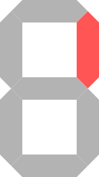
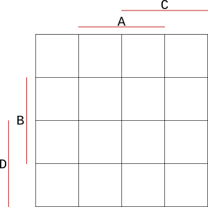
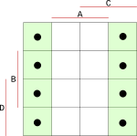
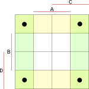
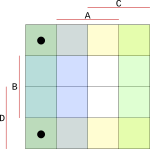
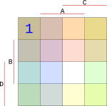
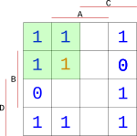
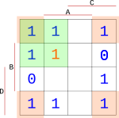
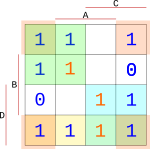

nazev = "Minimalizace"
tagy = ["unix", "algoritmy"]

+++
# Minimalizace

V tomto příkladu si vytvoříme driver jednoho segmentu sedmi-segmentového displeje a provedeme jeho minimalizaci.

## Vytvoření driveru

Vybereme se jeden segment z displeje, pro který navrhneme driver.

{height=100px}

Pro popis hodnot od 0 do 9 potřebujeme 4 bity - potřebujeme tedy 4 vstupy. Jako první je třeba vypsat stavy, při kterých bude segment svítit. Vypíšeme si tedy 4-bitová binární čísla s hodnotami 0 až 9.

```
x  A B C D

0  0 0 0 0
1  0 0 0 1
2  0 0 1 0
3  0 0 1 1
4  0 1 0 0
5  0 1 0 1
6  0 1 1 0
7  0 1 1 1
8  1 0 0 0
9  1 0 0 1
```

`A`, `B`, `C` a `D` jsou naše 4 vstupy a `x` je pouze hodnota v desítkové soustavě. Nyní musíme přidat výstupní bit `Q`, který nám definuje, při jaké hodnotě bude segment rozsvícen. U čísla `0` svítit bude, ale například u čísla `5` ne.


```
x  A B C D  Q

0  0 0 0 0  1
1  0 0 0 1  1
2  0 0 1 0  1
3  0 0 1 1  1
4  0 1 0 0  1
5  0 1 0 1  0
6  0 1 1 0  0
7  0 1 1 1  1
8  1 0 0 0  1
9  1 0 0 1  1
```

Sice nám zbývají další nevyužité hodnoty (10, 11, 12 atd.), ale u těch je nám nezáleží na jejich stavu. **To se nám hodí později při minimalizaci.**

Nyní si vypíšeme funkci, která popisuje všechny stavy, při kterých bude segment svítit. Například hned u stavu s hodnotou `1` svítit bude, proto popíšeme stavy vstupů jako $\bar{A}*\bar{B}*\bar{C}*D$. Vstupy s hodnotou `0` označíme čarou nad písmenem, což je *NOT*. Znaménko $*$ samozřejmě označuje *AND* a znaménko $+$ značí *OR*.

$$
f(x) = \\ \bar{A}*\bar{B}*\bar{C}*\bar{D} + \\ \bar{A}*\bar{B}*\bar{C}*D + \\ \bar{A}*\bar{B}*C*\bar{D} + \\ \bar{A}*\bar{B}*C*D + \\ \bar{A}*B*\bar{C}*\bar{D} + \\ \bar{A}*B*\bar{C}*D + \\ \bar{A}*B*C*\bar{D} + \\\bar{A}*B*C*D + \\ A*\bar{B}*\bar{C}*\bar{D} + \\ A*\bar{B}*\bar{C}*D
$$

A máme hotový vzorec pro implementaci jednoho segmentu. Pokud bychom ale chtěli tuto věc implementovat, potřebovali bychom 25 NOTů, 30 ANDů a 9 ORů, to je celých 64 součástek!!!? Proto je dobré provést minimalizaci.

## Minimalizace

Minimalizace nám pomůže zjednodušit náš vzorec pro implementaci a v reálném světě nám ušetří spousty peněz za součástky.

V našem případě využijeme Karnaughovu mapu o velikosti $4*4$.

{width=300px}

Do mapy doplníme všechny stavy při hodnotách `0` až `9` z naší první tabulky z výstupy `Q`. Mapa se vyplňuje tak, že musíme najít jeden společný průnik všech vstupů. Začneme vstupem `A`. Ten má na hodnotu `0`, vybereme tedy bloky v mapě, pro které platí, že `A` je `0`.

{width=150px}

{width=150px}

{width=150px}

{width=150px}

\newpage

Do bloku, na který jsme narazili sečtením všech průniků, zapíšeme hodnotu zda segment svítí nebo nesvítí. Protože jsme hledali blok pro desítkovou hodnotu `0`, při které bude segment svítit, dáme do mapy hodnotu `1` (bude svítit). Stejným postupem vyplníme celou tabulku pro zbylé hodnoty `1` až `9`.

{width=150px}

Pro minimalizaci musíme seskupit všechny hodnoty `1` do skupin nejlépe po čtyřech. Čím větší bloky, tím větší zjednodušení výsledku.

Pro Karnaughovu mapu platí, že hodnoty lze seskupovat i přes hrany, či přes rohy. Detaily o tom proč a jak toto funguje jsou popsány například na [wikipedii](https://en.wikipedia.org/wiki/Karnaugh_map).

Další specialita mapy je ta, že nevyplněné bloky si můžeme doplnit podle potřeby. Vzpomeňte si na začátek dokumentu, kde nám zbylo několik nevyužitých hodnot pro čísla `11`, `12` atd. U těch je nám jedno, v jakém stavu budou, a proto si je do mapy můžeme doplnit podle sebe a tím si uměle vytvořit lepší bloky pro minimalizaci.

První blok se nám nabízí například vlevo nahoře, kde si můžeme doplnit jedničku a vytvořit blok $2*2$.

{width=150px}

Dále můžeme využít to, že bloky lze vytvářet i přes rohy. V každém rohu se nachází `1`, tak je dáme do dalšího bloku.

{width=150px}

\newpage

Tímto způsobem dotvoříme zbytek bloků, dokud nebudou v blocích všechny námi vypsané (modré) jedničky.

{width=150px}

Všechny bloky teď popíšeme do vzorce. Protože bloky jsou o velikosti $2*2$, stačí nám na popis každého bloku pouze dva vstupy.

$$
f(x) = \bar{C}*\bar{D} + \bar{A}*\bar{B} + D*C + D*\bar{B}
$$

To dám dohromady dává pouze 12 součástek. Základní minimalizace je kompletní.
