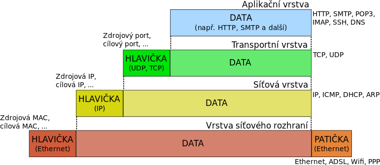

nazev = "Sítě"
tagy = ["unix", "networking"]

+++
# Síťové prvky

## Client

## Hub

## Switch

## Router

## Gateway

# Adresy

- IP adresa
- MAC adresa

# TCP/IP

Jde o síťovou architekturu, která vychází ze síťového modelu *ISO/OSI*. Nejdříve byly navrhnuty protokoly, později až architektura přímo pro počítačové sítě. Funguje nespolehlivě a nespojovaně na principech *Best Effort* a přepojování paketů.

## Vrstva síťového rozhraní

- Sloučené vrstvy L1 a L2 z *ISO/OSI*
- Pracuje s Ethernet rámci
- Kódování
- Samotná binární data

## Síťová vrstva

- IP adresy
- Směrování
- ARP, ICMP, ...
- Rozdělení dat na pakety / datagramy
- Uspořádání příchozích paketů / datagramů do původní podoby

## Transportní vrstva

- TCP / UDP
- Stará se o integritu dat apod.

## Aplikační vrstva

- Implementace protokolů (https, sftp, ssh, ntp, ...)
- Samotné aplikace komunikují s aplikační vstrvou pomocí portů (http 80, ssh 22, ...)

# Verze IP

## IPv4

Numerické adresy pro síťovou vrstvu ve formátu čtyř čísel v rozsahu 0-255 oddělených tečkou: `192.168.1.1`. Adresy jsou popsány 32 bity. Počet možných IPv4 adres je tedy $2^{32} = 4.29 * 10^{9}$.

## IPv6

Adresy jsou popsány 128 bity, tj. $2^{128} = 3.4 * 10^{38}$. Adresy IPv6 jsou popsány v osmi blocích čtyř hexadecimálních znaků oddělených dvojtečkou: `fd2f:77df:6fe6:0:5da8:f2da:1058:4a4b`.

# DHCP - Dynamic Host Configuration Protocol

# ARP - Address Resolution Protocol

# DNS - Domain Name System

# Síťové technologie

## IEEE 802.3 - Ethernet

### 10BASE5/2

### 10BASE-T

### 100BASE-TX

### 1000BASE-T

## IEEE 802.11 - WiFi

